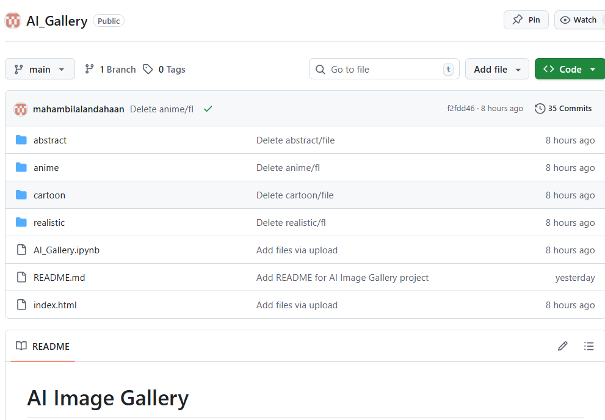
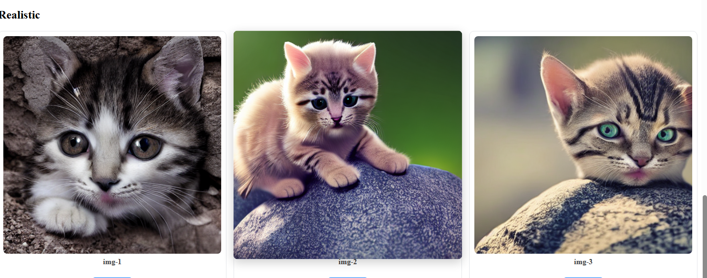

# 🎨 AI Image Gallery  
A simple and elegant web-based gallery showcasing AI-generated images created using **Stable Diffusion**.  
This project demonstrates prompt engineering, image generation, folder organization, and hosting with **GitHub Pages**.

---

## 🚀 Live Demo  
🔗 **View the Gallery:**  
https://mahambilalandahaan.github.io/AI_Gallery/

---

## 🧠 Project Overview  
This project displays images generated in multiple styles using **Stable Diffusion**.  
The goal was to learn:

- Prompt engineering  
- Batch image generation  
- Organizing outputs into categories  
- Hosting a static website using GitHub Pages  
- Writing clean documentation for a portfolio project  

---

## 🛠️ Tools & Technologies

| Component | Technology |
|----------|------------|
| Image Generation | **Stable Diffusion** |
| Language | Python |
| Notebook | Jupyter / Colab |
| Website | HTML + CSS |
| Hosting | GitHub Pages |
| File Management | OS, Python automation |

---

## 🖼️ Gallery Screenshot  
*(Captured from the live website)*  

---

## 📁 Project Structure

# AI_Gallery

## Folder Structure

- [abstract](./abstract/)
- [anime](./anime/)
- [cartoon](./cartoon/)
- [realistic](./realistic/)
- [AI_Gallery.ipynb](./AI_Gallery.ipynb)
- [index.html](./index.html)
- [README.md](./README.md)

  
📸 Screenshot:  

---

## 🧩 Image Categories
Generated using Stable Diffusion, grouped into four styles:

| Style | Description |
|-------|-------------|
| **Realistic** | Ultra-realistic, high-detail images |
| **Cartoon** | Bold outlines, solid color tones |
| **Anime** | Soft lighting, stylized characters |
| **Abstract** | Shapes, patterns, creative designs |

📸 Example screenshot:  

---

## 🔧 How It Works
1. Run Stable Diffusion in a notebook  
2. Generate images using different prompts  
3. Save outputs into folders (realistic, anime, cartoon, abstract)  
4. Build a clean HTML gallery  
5. Push to GitHub  
6. Deploy using GitHub Pages  

---

## 📤 Deployment  
This project is hosted using **GitHub Pages**.

**Path:**  
`Settings → Pages → Deploy from branch → main → root`

Once deployed, GitHub provides the live URL.

---

## ✨ Future Improvements
- Add search bar  
- Add filtering by style  
- Automatic thumbnail generation  
- Add dark/light theme switch  

---

## 🙌 Credits
- Stable Diffusion  
- Python (PIL, Diffusers)  
- GitHub Pages for hosting  

---

## 📌 Author  
**Mahambilalandahaan**  
AI Learner & Creative Explorer  

